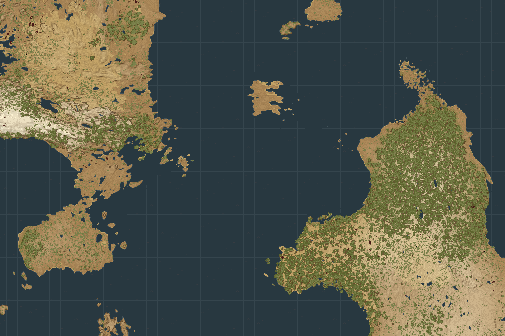

# 🗺️ VS Map Tools

**VS Map Tools** is a cross-platform GUI application that reads your [Vintage Story](https://www.vintagestory.at/) client-side minimap and exports it as a high-resolution PNG image.

### Key Features

- 💻 **Cross-platform** — runs on **Linux, macOS, and Windows**
- 📏 **Very high export size limits** when using downscaling
- 🌍 **Automatic world size and explored-area detection**
- 🧭 **Supports relative coordinates** — the ones players see in-game
- ⚡ **Optimized for large maps**

VS Map Tools can export either a **specific region** using coordinate bounds, or the **entire explored world automatically**, without manually defining limits.

Exports are **pixel-perfect by default**: each in-game block maps to exactly one pixel in the output image. For very large worlds, VS Map Tools supports **downscaled exports**, from 1:1 up to 1:32 blocks per pixel, allowing maps as large as **512,000 × 512,000 blocks**.

## Preview

  

  

**~ 6,000 × 6,000 blocks**  
_Custom map colors are provided by the [Medieval Map](https://mods.vintagestory.at/marximusmedievalmap) mod._

## Installation

1. From the Releases page, download the [latest version](https://github.com/elliotfontaine/vsmaptools/releases) corresponding to your operating system.
3. Extract the zip and run the application.

> No Vintage Story mods are required, the app reads the local minimap database directly.

## Roadmap

*Planned/potential features for future versions:*

- 👥 **Collaborative map export**  
  Merge multiple players’ minimap databases into a single world map

- 📍 **Waypoint rendering**  
  Display in-game waypoints directly on the exported map

- ⚡ **Further performance improvements**  
  Faster processing for very large maps

## License

This project is licensed under the **MIT License**. See the `LICENSE` file for more details.

